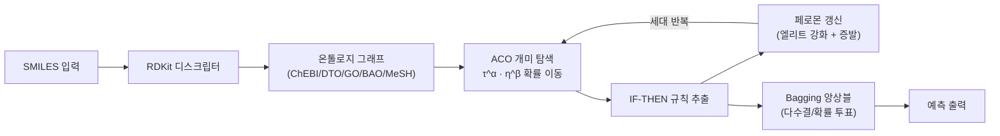

# SNACO-Forest 논문 정리 문서

> 전왕수 박사님 요청 항목 (2026-04-06) 기반 작성

---

## Q1. 모델 정의 — Neural Net 기반 트리인가? 백엔드는?

### 결론: **순수 규칙 기반 트리 모델 (Non-Neural)**

SNACO-Forest는 Neural Network를 **사용하지 않는** 순수 규칙 기반 앙상블 모델이다.

### 모델 아키텍처 요약

```
SMILES → RDKit 분자 디스크립터 → 온톨로지 그래프 → ACO 규칙 추출 → 앙상블 투표
```

| 구성 요소 | 설명 |
|---|---|
| **트리 구조** | 전통적 결정 트리의 IF-THEN 규칙 (`SplitCondition` 체인) |
| **분할 기준** | Information Gain / Gini / Gain Ratio / Chi-Square / PIG / Semantic Similarity |
| **앙상블** | Bootstrap Aggregating (Bagging) — 다수결/확률 평균 투표 |
| **백엔드** | NumPy 기반 순수 연산 (PyTorch 옵션은 존재하나 현재 ACO 경로는 전량 numpy) |

### 기존 트리 모델과의 차이점

전통적 결정 트리 (CART, C4.5 등)가 **탐욕적(greedy)** 하향식 분할을 수행하는 데 반해, SNACO-Forest는:

1. **온톨로지 그래프 위에서** 개미가 확률적으로 이동하며 feature 노드를 선택
2. 선택된 feature 시퀀스가 규칙의 **조건 체인**이 됨
3. 페로몬 피드백을 통해 **세대 간 학습**이 발생 — 좋은 규칙 경로가 강화됨

> **왜 Neural Net을 쓰지 않는가?**
> - **설명 가능성(Explainability)**: IF-THEN 규칙으로 완전 해석 가능
> - **소규모 데이터 적합**: 분자 특성 데이터셋은 수백~수만 건으로, NN의 파라미터 수 대비 데이터가 부족
> - **도메인 지식 주입**: 온톨로지(ChEBI, DTO, GO, BAO, MeSH)의 계층 구조를 그래프 엣지로 직접 활용 가능

### 논문 그림 제안



---

## Q2. 메타휴리스틱의 역할 — 파라미터 탐색 vs 모델 최적화?

### 결론: **모델 구조 최적화 (규칙 자체를 탐색)**

ACO는 단순한 하이퍼파라미터 튜닝이 아니라, **모델의 핵심 구성요소(규칙)를 직접 탐색**한다.

### ACO의 역할 상세

| 탐색 대상 | 설명 | 전통 AutoML 대응 |
|---|---|---|
| **Feature 선택 순서** | 개미가 온톨로지 그래프를 이동하며 어떤 feature를 조건에 포함할지 결정 | Feature Selection |
| **분할 임계값** | 선택된 feature의 최적 threshold를 Information Gain 기반으로 결정 | 각 노드의 split point |
| **규칙 깊이** | max_path_length 내에서 자연스럽게 종료 (IG < min_gain이면 조기 종료) | Tree depth |
| **규칙 집합 구성** | 엘리트 페로몬 갱신으로 세대 간 좋은 규칙 조합 수렴 | Ensemble selection |

### AutoML과의 핵심 차이

| 관점 | AutoML | SNACO-Forest ACO |
|---|---|---|
| **탐색 대상** | 하이퍼파라미터 (learning rate, depth 등) | 규칙 구조 자체 (feature 순서, 임계값, 규칙 조합) |
| **탐색 공간** | 연속/이산 파라미터 공간 | 온톨로지 그래프 위의 경로 공간 |
| **피드백** | Bayesian Optimization / Bandit | 페로몬 갱신 (ACO) |
| **도메인 지식** | 사용하지 않음 | 온톨로지 계층 구조로 탐색 가이드 |
| **결과 해석** | 블랙박스 | 완전 해석 가능 (IF-THEN 규칙) |
| **계산 비용** | 모델 전체 재학습 × N회 | 그래프 탐색 × N 개미 (경량) |

---

## Q3. 온톨로지 규칙 — 분류 vs 회귀는 어떻게 다른가?

### 결론: **동일한 설계 프레임워크, 3개 지점에서 task-aware 분기**

| 구성 요소 | Classification | Regression |
|---|---|---|
| **① 분할 기준** | Entropy / Gini / Gain Ratio / Chi² / PIG | **Variance Reduction** |
| **② 리프 예측** | 가중 다수결 (`_weighted_majority_class`) | **평균값** (`np.mean`) |
| **③ 적합도** | F1-score 기반 (`f1 × log(1+coverage)`) | **R²-유사** (`1 - MSE/Var`) |
| **앙상블 투표** | 리프 확률 평균 → threshold 0.5 | 트리별 예측 산술 평균 |
| **평가 지표** | AUC-ROC, F1, Balanced Acc | MAE, RMSE, R² |

> 분류와 회귀는 **동일 ACO 탐색 + 규칙 추출 파이프라인** 사용. 분할 기준(impurity → variance)과 리프 예측(class → mean)만 교체.

---

## MolCLR 성능 비교 기준값 (Wang et al., 2022)

> MolCLR: GIN encoder, Scaffold Split, ROC-AUC (%)

| Dataset | Samples | MolCLR (GIN) | SNACO-Forest | 비고 |
|---|---|---|---|---|
| **BBBP** | 2,039 | 71.6 | *TBD* | 소규모, BBB penetration |
| **BACE** | 1,513 | 81.9 | *TBD* | 최소 데이터셋 |
| **ClinTox** | 1,478 | 91.9 | *TBD* | 소규모, FDA toxicity |
| **HIV** | 41,127 | 78.3 | *TBD* | 대규모, 극심한 클래스 불균형 |
| **Tox21** | 7,831 | 75.0 | *TBD* | 중규모, 12 multi-target |
| **SIDER** | 1,427 | 59.9 | *TBD* | 최소, 27 side-effect targets |
| **MUV** | 93,087 | 79.7 | *TBD* | 최대규모, 17 bioassay targets |

### 데이터 규모별 성능 분석 관점 (박사님 요청)

| 규모 | 데이터셋 | 샘플 수 | 논의 포인트 |
|---|---|---|---|
| **소규모 (<2K)** | BBBP, BACE, ClinTox, SIDER | 1.4K~2K | SNACO-Forest의 도메인 지식 주입이 소규모에서 유리할 수 있음 |
| **중규모 (2K~10K)** | Tox21 | ~8K | 적정 학습 데이터, 규칙 기반 vs 사전학습 비교 기준선 |
| **대규모 (>10K)** | HIV, MUV | 41K, 93K | 사전학습 모델(MolCLR)이 대규모에서 유리. ACO의 `max_samples` 제한 영향 |

> [!IMPORTANT]
> HIV와 MUV는 `max_samples=20000`으로 제한됨 → 전체 데이터 대비 sampling bias 논의 필요

---

## 부록: 규칙 시스템 슈도코드

### Algorithm 1: SNACO-Forest 전체 파이프라인

```
Algorithm 1: SNACO-Forest Training
━━━━━━━━━━━━━━━━━━━━━━━━━━━━━━━━━━

Input:
  D = {(x_i, y_i)}  : training data (SMILES → descriptors)
  G = (V, E)         : ontology graph (ChEBI/DTO/GO/BAO/MeSH)
  T                  : number of trees (default 8)
  K                  : number of ants per tree (default 25)
  G_max              : number of generations (default 3)
  ρ                  : evaporation rate (default 0.10)
  ε                  : elite ratio (default 0.20)

Output:
  F = {R_1, R_2, ..., R_T}  : ensemble of rule sets

1:  Initialize pheromone τ(e) ← 1.0  for all e ∈ E
2:  Inject domain seed rules into pheromone (optional)
3:
4:  for g = 1 to G_max do                    ▷ Generation loop
5:    rules_g ← ∅
6:    for t = 1 to T do                      ▷ Tree (bootstrap) loop
7:      D_t ← BootstrapSample(D)
8:      R_t ← ∅
9:      for k = 1 to K do                    ▷ Ant loop
10:       r_k ← EXTRACT_RULE(G, D_t)
11:       R_t ← R_t ∪ {r_k}
12:       UPDATE_PATH_PHEROMONE(G, r_k)      ▷ Local update
13:     end for
14:     rules_g ← rules_g ∪ R_t
15:   end for
16:   ELITE_PHEROMONE_UPDATE(G, rules_g, ρ, ε)  ▷ Global update
17: end for
18:
19: F ← Deduplicate and sort rules by fitness
20: return F
```

### Algorithm 2: ACO 기반 규칙 추출 (단일 개미)

```
Algorithm 2: EXTRACT_RULE — Single Ant Rule Extraction
━━━━━━━━━━━━━━━━━━━━━━━━━━━━━━━━━━━━━━━━━━━━━━━━━━━━━

Input:
  G = (V, E)         : ontology graph with pheromone τ
  D_t                : bootstrap sample {(x_i, y_i)}
  α, β               : pheromone/heuristic exponents
  d_max              : max rule depth
  θ_min              : min information gain threshold

Output:
  r = (conditions, prediction, fitness)

1:  node ← SELECT_START_NODE(G)
2:  visited ← {node}
3:  conditions ← []
4:  active_mask ← [True] * |D_t|   ▷ All samples initially active
5:
6:  for step = 1 to max_steps do
7:    if |conditions| ≥ d_max then break
8:    if |active_samples| < 2 × min_leaf then break
9:
10:   ▷ ACO probabilistic transition
11:   candidates ← NEIGHBORS(G, node) \ visited
12:   if candidates = ∅ then break
13:   for each c ∈ candidates do
14:     τ_c ← pheromone(node, c)
15:     η_c ← 3.0 if is_feature(c) else 1.0
16:     w_c ← τ_c^α × η_c^β
17:   end for
18:   next ← ROULETTE_SELECT(candidates, weights)
19:
20:   ▷ If next is a feature node → evaluate split
21:   if is_feature(next) then
22:     (θ*, IG, op) ← FIND_BEST_THRESHOLD(D_t[active], feature, criterion)
23:     if IG < θ_min then continue
24:     ▷ Branch direction
25:     if task = "regression" then
26:       go_left ← Var(left) ≤ Var(right)
27:     else
28:       go_left ← WeightedPurity(left) ≥ WeightedPurity(right)
29:     end if
30:     conditions.append(feature, op, θ*, IG)
31:     active_mask ← active_mask AND split_mask
32:   end if
33:
34:   visited ← visited ∪ {next};  node ← next
35: end for
36:
37: ▷ Assemble leaf prediction
38: if task = "regression" then
39:   prediction ← mean(y[active])
40:   fitness ← R²_score × log(1 + coverage)
41: else
42:   prediction ← weighted_majority(y[active])
43:   fitness ← F1_score × log(1 + coverage)
44: end if
45: return Rule(conditions, prediction, fitness)
```

### Algorithm 3: 엘리트 페로몬 갱신

```
Algorithm 3: ELITE_PHEROMONE_UPDATE
━━━━━━━━━━━━━━━━━━━━━━━━━━━━━━━━━━

Input:
  G = (V, E), rules, ρ, ε

1:  ▷ Step 1: Global evaporation
2:  for each edge (u,v) ∈ E do
3:    τ(u,v) ← max((1 - ρ) × τ(u,v), τ_min)
4:  end for
5:
6:  ▷ Step 2: Select elite rules (top ε%)
7:  elite ← TOP_K(rules, ⌈ε × |rules|⌉, key=fitness)
8:
9:  ▷ Step 3: Deposit pheromone on elite paths
10: for each r ∈ elite do
11:   Δτ ← fitness(r) / |path(r)|
12:   for each edge (u,v) in path(r) do
13:     τ(u,v) ← τ(u,v) + Δτ
14:   end for
15: end for
16:
17: ▷ Step 4: Clamping [τ_min, τ_max]
18: for each edge (u,v) ∈ E do
19:   τ(u,v) ← clamp(τ(u,v), τ_min, τ_max)
20: end for
```

### Algorithm 4: 온톨로지 시드 규칙 주입

```
Algorithm 4: Domain Seed Rule Injection
━━━━━━━━━━━━━━━━━━━━━━━━━━━━━━━━━━━━━━

Input:  dataset_name, OWL ontology
Output: rules (max 15 per dataset)

▷ Rule types (동일 3종류, 분류/회귀 구분 없음):
  DOMAIN(property, op, value)       e.g., hasTPSA < 90.0
  CONCEPT(class_name)               e.g., IsA(AromaticMolecule)
  QUALIFICATION(property, class)    e.g., ∃hasFunctionalGroup.Halogen

▷ Dataset-specific domain knowledge:
  BBBP    → BBB penetration thresholds (TPSA, LogP, MW, HBD)
  BACE    → BACE-1 pharmacophore (Amidine, Guanidine)
  ClinTox → FDA toxicity alerts (Michael Acceptor, Epoxide)
  HIV     → antiviral patterns (Imidazole, Nucleoside)
  Tox21   → NR/SR assay alerts (Quinone, Phenol)
  SIDER   → MedDRA SOC classification
  MUV     → PubChem BioAssay scaffold patterns
```
